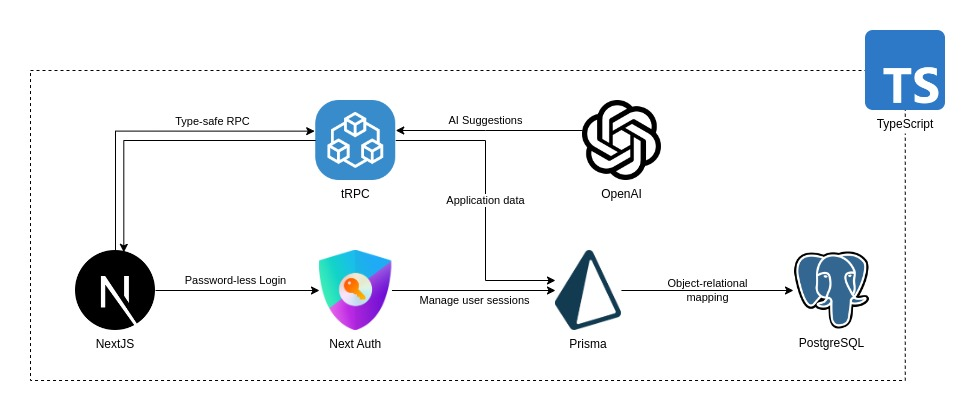
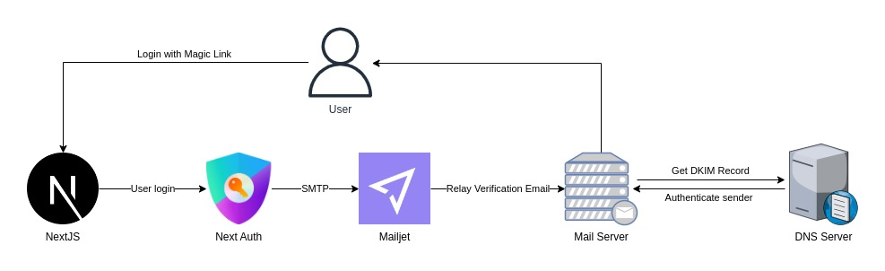

# GreenHarmony

## Introduction 

GreenHarmony is an all-in-one volunteer management platform that aims to affirm and recognise the contributions of volunteers and participants. Organising and managing volunteers has never been easier with GreenHarmony. We streamline the whole process from volunteer registration to attendance taking and contribution recognition. 

Join us in celebrating the spirit of volunteerism and creating a harmonious environment where every contribution is valued.

## Overview

### Architecture



Using the T3 stack, we implement modern, server-side rendered application which is highly efficient and secure. TypeScript allows us to perform static type checking, allowing us to quickly and efficiently perform remote procedure calls with tRPC. 

### User Authentication



We implement a passwordless login feature that allows users to login to our application through __magic link__.
Emails are signed using a DKIM key, and is verified by the receiving mail server through a DNS TXT record to prevent our emails from being impersonated by potential attackers.

## Development

### Getting Started

Ensure that PostgreSQL version `>15` is installed locally 

Configure the environment variables by creating a `.env` file and setting the following variables
```py
DATABASE_URL=<"postgresql://<username>:<password>@<host>:5432/<database_name>"
NEXTAUTH_URL="http://localhost:3000"
NEXTAUTH_SECRET=<random_string>
```

> Note: `NEXTAUTH_SECRET` is used to securely encrypt cookies and hash tokens and is __required__ in production.
> To generate a random string, run `openssl rand -base64 32`.

```sh
npm install
npm run dev
```

Create a database and run the following command:
```sh
npx prisma db push
```

Then populate the database with dummy data by running the queries located in `prisma/data.sql`.

### Code style

Husky and Lint-staged is used to standardise the coding style with Prettier, while ESlint is used to enforce code quality and are run automatically through a pre-commit hook.

### Prisma schema

After making changes to `prisma/schema.prisma`, format the schema and update the database.

```sh
npx prisma format
npx prisma db push
```

Prisma should also run `prisma generate` automatically after the push operation is complete.
 
> Note: Due to existing regressions in `zod` `>3.21.1`, the latest version of `zod` is not used.
>
> See https://github.com/colinhacks/zod/issues/2184 for more information